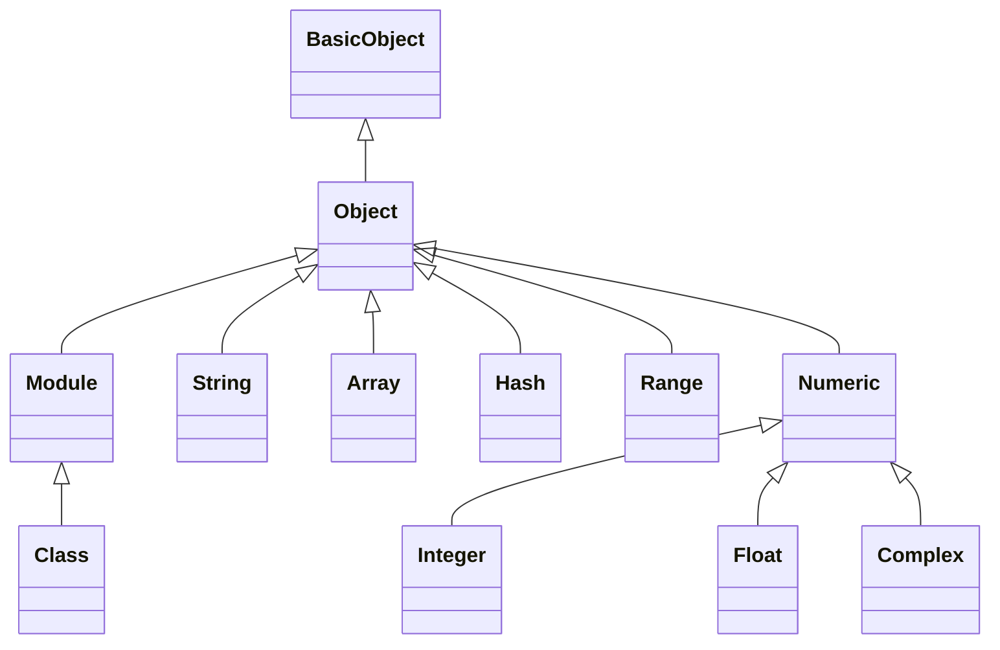
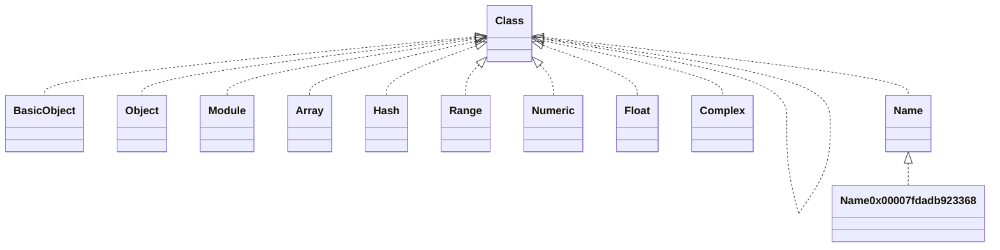

# Ruby Syntax

[TOC]

## 前言

根据Ruby官方文档[Ruby Syntax](https://ruby-doc.org/core-2.7.1/doc/syntax_rdoc.html)这一节的分类，对应本文的前11个章节。

* Literals 

介绍Ruby的相关字面常量，例如Number、String、Array、Hash等


* Assignment 

介绍Ruby的赋值以及变量定义的语法


* Control Expressions 

介绍Ruby的控制语句，例如`if`, `unless`, `while`, `until`, `for`, `break`, `next`, `redo`等


* Methods 

介绍Ruby的方法以及方法参数


* Calling Methods 

介绍如何调用Ruby的方法


* Modules and Classes 

介绍Ruby的Module和Class


* Exceptions 

介绍Ruby的异常处理


* Precedence 

介绍Ruby的操作符优先级


* Refinements 

介绍Ruby的实验性特性


* Miscellaneous 

介绍Ruby相关杂项，例如`alias`, `undef`, `BEGIN`, `END`等


* Comments 

介绍Ruby的行注释、块注释


## 1、Literals

Ruby中所有数据都是基于类的，即基本类型（整型、浮点数）也是对象。literals数据类型，有如下几种[^2]

- Booleans and nil（TrueClass/FalseClass、NilClass）
- Numbers（Integer、Float、Fixnum）
- Strings（String）
- Symbols（Symbol）
- Arrays（Array）
- Hashes（Hash）
- Ranges（Range）
- Regular Expressions（Regexp）
- Procs（Proc）


irb中输出，如下

```ruby
2.4.0 :001 > true.class
 => TrueClass 
2.4.0 :002 > false.class
 => FalseClass 
2.4.0 :003 > nil.class
 => NilClass 
2.4.0 :004 > "Ruby".class
 => String 
2.4.0 :005 > 1.class
 => Integer 
2.4.0 :006 > 4.5.class
 => Float 
2.4.0 :007 > 3_463_456_457.class
 => Integer 
2.4.0 :008 > :age.class
 => Symbol 
2.4.0 :009 > [1, 2, 3].class
 => Array 
2.4.0 :010 > h = {:name => "Jane", :age => 17}
 => {:name=>"Jane", :age=>17} 
2.4.0 :011 > h.class
 => Hash 
2.4.0 :012 > (1..2).class
 => Range 
2.4.0 :013 > /.*/.class
 => Regexp 
2.4.0 :014 > -> { 1 + 1 }.class
 => Proc 
```

> 示例代码见data_type.rb


### (1) String

#### sub方法和gsub方法

String提供sub实例方法和gsub实例方法，用字符串替换。

* sub实例方法，只替换满足匹配的首个字符串
* gsub（global sub）实例方法，全局替换满足匹配的所有字符串

> sub和gsub方法，对应有修改入参字符串的版本：sub!和gsub!方法


以gsub方法为例，其方法签名，如下

```ruby
gsub(pattern, replacement) → new_str
gsub(pattern, hash) → new_str
gsub(pattern) {|match| block } → new_str
gsub(pattern) → enumerator
```

pattern参数，可以是字符串或者Regexp对象。

举个例子，如下

```ruby
def gsub_with_string_pattern(string)
  string.gsub('potato', 'banana')
end

def gsub_with_Regexp_pattern(string)
  string.gsub(/p[a-zA-Z]+o/, 'banana')
end

def gsub_with_Regexp_pattern_anchored(string)
  string.gsub(/^p[a-zA-Z]+o$/, 'banana')
end

dump_object(gsub_with_string_pattern("One potato, two potato, three potato, four."))
dump_object(gsub_with_Regexp_pattern("One potato, two potato, three potato, four."))
dump_object(gsub_with_Regexp_pattern_anchored("One potato, two potato, three potato, four."))
```

注意，pattern参数是字符串，即使字符串是正则表达式，不会按照正则匹配。举个例子，如下

```ruby
def gsub_with_string_pattern_literal(string)
  string.gsub('\d+', "[number]")
end

dump_object(gsub_with_string_pattern_literal("ff001.png"))
dump_object(gsub_with_string_pattern_literal('pattern is \d+')) # output: "pattern is [number]"
```


#### gsub方法的capture group

gsub方法，支持将满足正则匹配的字符串换成动态的捕获变量值。举个例子，如下

```ruby
def regexp_capture_group(string)
  string.gsub(/(\d+)/, '\1')
end

def regexp_capture_group_anchored(string)
  string.gsub(/[a-zA-Z]*(\d+)/, '\1')
end

dump_object(regexp_capture_group('aaa074')) # output: "aaa074"
dump_object(regexp_capture_group_anchored('aaa074')) # output: "074"
```

* aaa074按照`/(\d+)/`匹配，满足匹配的是074换成捕获变量值074，所以最终替换后的字符串是aaa074
* aaa074按照`/[a-zA-Z]*(\d+)/`匹配，满足匹配的是aaa074换成捕获变量值074，所以最终替换后的字符串是074


### (2) Regexp

Regexp类用于表示正则表达式。


#### 初始化Regexp

Regexp初始化有三种方式

* /xxx/方式
* %r{xxx}方式
* 使用new方法的方式

举个例子，如下

```ruby
def create_with_forward_slashes
  return /hay/
end

def create_with_r_percent_literal
  return %r{hay}
end

def create_with_new
  return Regexp.new('hay')
end
```

> 示例方法，见data_type_Regexp_create.rb


#### match方法

Regexp实例提供match方法，用于匹配字符串。如果存在匹配，则该方法返回MatchData实例，否则返回nil。

举个例子，如下

```ruby
def create_with_forward_slashes
  return /hay/
end

match_data = create_with_forward_slashes.match('haystack')

dump_object(match_data)
dump_object("original string: #{match_data.string}")
dump_object("matched string: #{match_data.to_s}")
```

MatchData的string方法返回原始需要匹配的字符串，而to_s方法返回满足匹配的字符串。


## 2、Assignment

### (1) `||=`条件赋值操作符

`||=`是一个条件赋值操作符(conditional assignment operator)，有一个类似||的短路逻辑。

以`a ||= b`为例[^36]，如果

* a是未定义或false，则将b赋值给a
* a有定义且值可以判断为true，则直接使用a值，不会将b赋值给a

可以将`a ||= b`理解为`a || a = b`。

举个例子，如下

```ruby
a ||= nil # => nil
a ||= 0 # => 0 # a = 0赋值成功
a ||= 2 # => 0 # a没有赋值成功，还是之前的0

foo = false # => false
foo ||= true # => true
foo ||= false # => true
```


#### a. 变量赋值的懒加载方法

使用`||=`，结合`begin...end`代码块，可以实现一个懒加载方法[^37]，如下

```ruby
def source
  @source ||= begin
    { :key => "value "}
  end
end
```

当首次访问source方法时，才会初始化@source变量，而且只会初始化一次。


## 3、Control Expressions


## 4、Methods

### (1) 特殊方法修饰

#### a. dangerous方法

```ruby
class String
  def dangerous_method!
    self.upcase!; # Note: change self itself
  end
end

def test_dangerous_method
  foo = 'this is a string'
  foo.dangerous_method! # Note: change foo itself
  puts foo
end
```

​      Ruby约定，方法名以`!`结尾，表示这个方法会修改对象本身或者对象内部状态，称为dangerous方法。例如String的`upcase!`方法。

 

#### b. 返回值类型为bool的方法

​       Ruby约定，方法名以`?`结尾，表示这个方法的返回值类型是bool，例如Object提供的`is_a?`函数和`kind_of?`函数。


#### c. 类方法

类方法有两种定义方式，一种是self.method，一种`class << self ... end`块中定义类方法[^20]。

举个例子，如下

```ruby
class MyObject

  # Note: style 1
  def self.description
    return 'This is a MyObject class'
  end

  # Note: style 2
  class << self
    def debug_description
      return "This is a MyObject class: #{self}"
    end
  end
end
```


> 示例代码，见method_class_method.rb


### (2) 添加方法

TODO: https://stackoverflow.com/questions/34528649/ruby-add-method-to-a-class

http://rubyblog.pro/2017/04/class-methods-and-instance-methods-by-including-one-module


## 5、Calling Methods

### (1) 方法的传参方式[^3]

Ruby方法传参方式，归纳有下面几种

- 正常传参方式，参数有序性
- 可选参数，参数有序性
- keyword参数，参数无序性
- 可变参数列表

> 示例代码，见
>
> method_argument_1_normal.rb
>
> method_argument_2_optional.rb
>
> method_argument_3_keyword.rb
>
> method_argument_4_variable_list_as_array.rb
>
> method_argument_5_variable_list_as_hash.rb


#### a. 正常传参方式

正常传参方式：实参和形参是一一对应的，而且实参要保证顺序。


举个例子，如下

```ruby
def write(file, data, mode)
  ...
end
```

write方法有三个参数，必须按照顺序传入3个实参。


#### b. 可选参数

可选参数：参数有默认值，该形参对应的实参可以不传，使用默认值。


注意：

> 1. 两个及以上可选参数总是位于正常参数之后，而且可选参数可以有多个。否则，脚本执行报错。
>
> 举个错误的例子，如下
>
> ```ruby
> def write3(file, data, mode = "w", size, name = "default")
> end
> 
> $ syntax error, unexpected '=', expecting ')'
> data, mode = "w", size, name = "default")
>                            ^
> $ syntax error, unexpected ')', expecting end-of-input
> = "w", size, name = "default")
>                            ^
> ```
>
> 正确形式是
>
> ```ruby
> def write3_fixed(file, data, size, mode = "w", name = "default")
> end
> ```
>
> 2. 一个可选参数，允许在正常参数之前。举个例子，如下
>
> ```ruby
> def write2(file = 'default', data, mode, size)
>   ...
> end
> 
> ```
>
> 调用根据参数个数，自动匹配对应参数，如下
>
> write2(`data` "cats are cool!", `mode` "w", `size` 10)
> write2(`file` "cats.txt", `data` "cats are cool!", `mode` "r", `size` 10)


#### c. keyword参数

keyword参数，指形参后面跟一个冒号，表示实参必须以键值对的形式传入。

keyword参数的好处是实参可以不用保序，而且调用有key做描述，不用转到方法签名处，更加清楚。


举个例子

```ruby
# Note: the last is optional keyword argument
def write(file:, data:, mode: "rw")
  ...
end

# Note: keyword argument mixed with normal argument
def write2(file, data:, mode: "rw")
  ...
end

write(data: 123, file: "test.txt")
write2("test.txt", data: 123, mode: 'r')
```

注意：

> keyword参数，要求实参必须以键值对的形式传入，否则脚本执行出错


#### d. 可变参数列表

可变参数列表分为两种：传入多个正常参数，和传入多个keyword参数


##### 1. 传入多个正常参数，可用splat operator(`*`)来接收

举个例子

```ruby
def print_all(*args)
  # Note: args is an array, but *args is a placeholder which expanded as literal elements
  dump_object(args)

  # Note: expand *args as 1, 2, 3, 4, 5
  method_with_5_args(*args)
end

print_all(1, 2, 3, 4, 5)
```

在print_all函数中args变成一个数组对象，如果再对它使用splat operator(`*`)，则展开为字面数组。例如`method_with_5_args(*args)`，*arg展开为5个参数传给method_with_5_args函数


##### 2. 传入多个keyword参数，可用double splat operator(`**`)来接收

举个例子

```ruby
def print_all(**args)
  # Note: args is a hash
  dump_object(args)

  # Note: expand *args as [:x, 1], [:y, 2]
  method_with_2_arguments *args

  # Note: **args also a hash
  dump_object(**args)
end

print_all(x: 1, y: 2)
```

在print_all函数中args变成一个Hash对象，而*args将Hash对象转成数组，**args还是本身的Hash对象


#### e. 混合多种传参方式

根据上面几种传参方式，可以混合使用，因此存在优先级：required -> optional -> variable -> keyword

```ruby
# Note: required -> optional -> variable -> keyword
def testing(a, b = 1, *c, d: 1, **x)
  # p a,b,c,d,x
  dump_object(a)
  dump_object(b)
  dump_object(c)
  dump_object(d)
  dump_object(x)
end

testing('a', 'b', 'c', 'd', 'e', d: 2, x: 1)
```

`**x`和d: 1都属于keyword参数，`*c`属于variable参数

> 示例代码，见method_argument_6_mixed.rb


#### d. 接收所有参数

Ruby方法传参可以使用通配符`*`，接收所有参数。此方式不常见，但配合super方法可以将参数透传给父类方法。

举个例子，如下

```ruby
class Food
  def nutrition(vitamins, minerals)
    puts vitamins
    puts minerals
  end
end

class Bacon < Food
  def nutrition(*)
    super
  end
end

bacon = Bacon.new
bacon.nutrition("B6", "Iron")
```

Food的nutrition方法的参数个数修改了，不影响子类Bacon的nutrition方法。


### (2) 方法的block参数[^6]

#### a. 传block参数

Ruby方法可以使用block传参，需要使用`yield`以及`block_given?`来调用和检查block。

* `yield`，在ruby方法中使用`yield`调用block，可以将block需要的参数，传给`yield`
* `block_given?`，用于检查方法的参数中是否block传入。如果不检查，传入非block参数，用`yield`调用会出现异常

举个例子，如下

```ruby
def my_method
  puts "reached the top"
  # Note: call the block parameter by using `yield`
  status = yield("John", 2) if block_given?
  puts "reached the bottom"
  puts "status code: #{status}"
end

my_method do |name, age|
  puts "Hello, #{name} in #{age} years old"
  puts "reached yield"
  1
end
```


#### b. 同时传正常参数和block参数

Ruby方法允许同时传正常参数和block参数，但是block参数有且仅有一个[^6]，而且总是在最后一个。

举个例子，如下

```ruby
def my_map(array)
  new_array = []

  for element in array
    new_array.push yield element if block_given?
  end

  new_array
end

result = my_map([1, 2, 3]) do |number|
  number * 2
end

puts result
```

my_map方法，实际上接收两个参数，一个参数是数组，另一个参数是block

> 示例代码，见block_4_method_normal_parameter_and_block_parameter.rb


#### c. 显式block参数

在上面提到yield和block_given?方式，适用于每个方法的隐含的block参数，而且这个block参数必须是方法的最后一个参数。

除了这种传block参数外，还存在显式block参数，也称为**&参数** (ampersand parameter)[^28]

举个例子，如下

```ruby
def a_method(&block)
  dump_object(block)
  block.call()
end
```

上面&block是一个&参数，block变量名可以是其他命名。block是Proc对象，调用它的call方法，让block执行。

如果要调用a_method方法，正常传入一个block块即可，如下

```ruby
a_method { puts "x" } # => #<Proc:...>
```

&参数支持block、Proc以及lambda对象

举个例子，如下

```ruby
# Case 1:
a_method { puts "x" } # => #<Proc:...>

# Case 2:
a_proc = Proc.new { "x" }
a_method(&a_proc) # => #<Proc:...>
# a_method(a_proc) # Runtime: ArgumentError

# Case 3:
a_lambda = -> () { "x" } # => #<Proc:... (lambda)>
a_method(&a_lambda) # => #<Proc:... (lambda)>
```


如果block有多个参数，调用call方法，传入对应个数和类型的参数即可。举个例子[^29]，如下

```ruby
def a_method_block_with_arguments(&block)
  dump_object(block)
  block.call('Hello', 'World') if block
end

# Case 4: pass a block
a_method_block_with_arguments do |arg1, arg2|
  puts "arg1 = #{arg1}"
  puts "arg2 = #{arg2}"
end

# Case 5: pass a nil as block
a_method_block_with_arguments
```

对于block调用，注意block有可能是nil，需要进行保护下

>  示例代码，见block_5_method_with_explicit_block.rb


### (3) 常用Ruby方法

#### a. system

格式：**system([env,] command... [,options]) → true, false or nil**

作用：产生一个子shell，执行command

说明：

返回nil，表示命令执行出错。

返回true，表示命令执行返回状态为0。

返回false，表示命令执行返回状态为非0。

官方描述，如下

> system returns `true` if the command gives zero exit status, `false` for non zero exit status. Returns `nil` if command execution fails. An error status is available in `$?`.


除了使用system方法，还有下面的几种方式获取shell command输出结果[^7]

但是下面几种方式，执行命令，但是都不能完全得到命令的正常输出以及错误输出。

```ruby
exec("echo 'hello world'") # exits from ruby, then runs the command
system('echo', 'hello world') # returns the status code
sh('echo', 'hello world') # returns the status code
`echo "hello world"` # returns stdout
%x[echo 'hello world'] # returns stdout
```


可以使用`Open3.capture3`方法，获取三个返回值。举个例子，如下

```ruby
require 'open3'
stdout, stderr, status = Open3.capture3("ls")
if status.success?
  # success
else
  # failure
end
```

说明

> `Open3`库是Ruby内置库，可以直接使用。示例代码，见07_git-batch.rb


## 6、Modules and Classes

### (1) Object Hierarchy

#### a. Inheritance Hierarchy

Ruby是一门OOP语言，所有数据类型都是对象。Ruby提供一些内置对象，如BasicObject、Object、Module、Class、String等。它们的继承关系[^15]，如下





说明

> 1. 示例代码，见data_type_hierarchy.rb
> 2. 继承关系，通过superclass方法来检查，而不是使用ancestors方法


#### b. Instantiation Hierarchy

Instantiation Hierarchy（实例化层次），不同于Inheritance Hierarchy（继承层次）。当定义一个类class（注意：class，不是Class），如下

```ruby
class Name
 # some code describing the class behavior
end
```

实际上，创建一个Name对象（或者称全局变量），它的类型是Class，但是它不是继承Class，而是Object。通过class方法（Object类提供的），可以检查某个对象的类型是什么。

根据实例化的关系，如下



可以看出大多数类的类型都是Class，而实例化的对象的类型是具体类，例如Name对象（Name:0x00007fdadb923368）的类型是Name。另外，值得注意的是Class的类型是Class，即它本身。


#### c. Ancestors Hierarchy

Ancestors Hierarchy（祖先层次），主要是ancestors方法（Module提供的方法）提供的顺序。Ruby文档对ancestors方法的说明，如下

> Returns a list of modules included/prepended in *mod* (including *mod* itself).

这里mod应该是module。通过“Instantiation Hierarchy”一节，可以看出所有类(class)的类型都是Class，而Class继承自Module，因此所有class也是可以视为是Module实例化的类对象。通过mix-in方式（include或prepend语句），插入特定module，导致ancestors不一定是继承顺序。

举个例子，如下

```ruby
def check_ancestors(var)
  puts "#{var} --> #{var.ancestors.inspect}"
end

class MyBaseClass
end

class MyDerivedClass < MyBaseClass
end

check_ancestors(BasicObject)
check_ancestors(Object)
check_ancestors(Module)
check_ancestors(Class)
check_ancestors(String)
check_ancestors(Array)
check_ancestors(Hash)
check_ancestors(Range)
check_ancestors(Numeric)
check_ancestors(Float)
check_ancestors(Complex)
check_ancestors(MyBaseClass)
check_ancestors(MyDerivedClass)
```

输入结果如下

```shell
BasicObject --> [BasicObject]
Object --> [Object, Kernel, BasicObject]
Module --> [Module, Object, Kernel, BasicObject]
Class --> [Class, Module, Object, Kernel, BasicObject]
String --> [String, Comparable, Object, Kernel, BasicObject]
Array --> [Array, Enumerable, Object, Kernel, BasicObject]
Hash --> [Hash, Enumerable, Object, Kernel, BasicObject]
Range --> [Range, Enumerable, Object, Kernel, BasicObject]
Numeric --> [Numeric, Comparable, Object, Kernel, BasicObject]
Float --> [Float, Numeric, Comparable, Object, Kernel, BasicObject]
Complex --> [Complex, Numeric, Comparable, Object, Kernel, BasicObject]
MyBaseClass --> [MyBaseClass, Object, Kernel, BasicObject]
MyDerivedClass --> [MyDerivedClass, MyBaseClass, Object, Kernel, BasicObject]
```


#### 总结

Ruby对象层次体系有上面三种层次，导致自定义的类中可以使用到三种不同来源的方法，比如

* 类的类型提供方法
  * 自定义类的new类方法，实际上是由Class提供的实例方法new，因为自定义类是Class的一个实例
  * ancestors类方法，实际上由Module提供，Class继承自Module，因此自定义类也可以使用ancestors方法
* 类的父类提供方法
  * class类方法，实际上由Object提供，自定义类继承自Object，因此自定义类也可以使用class方法

* mix-in方式导入的Module
  * puts/p/pp/print等内置方法，实际上由Kernel提供，Kernel是Module的一个实例。Object通过mix-in方式，将Kernel导入到Object自身，因此拥有了Kernel的一些方法


### (2) Class

通过“Instantiation Hierarchy”一节，可以看出所有类(class)的类型都是Class。Class提供的方法比较少，主要下面几个

```ruby
+ new(super_class=Object) → a_class
+ new(super_class=Object) { |mod| ... } → a_class
- allocate() → obj
- inherited(subclass)
- new(args, ...) → obj
- superclass → a_super_class or nil
```

主要介绍下类方法new、实例方法new以及inherited实例方法


* 类方法new，有两种签名

使用Class的new类方法，可以创建一个运行时类对象。举个例子，如下

```ruby
fred = Class.new do
  def meth1
    "hello"
  end
  def meth2
    "bye"
  end
end

a = fred.new
puts fred.superclass #=> Object
puts a.inspect   #=> #<#<Class:0x100381890>:0x100376b98>
puts a.meth1     #=> "hello"
puts a.meth2     #=> "bye"
```

fred是一个类对象，值得注意的是，上面运行时创建类，和下面代码定义fred是一样的。

```ruby
class fred
  def meth1
    "hello"
  end
  def meth2
    "bye"
  end
end
```


* inherited实例方法

```ruby
class Foo
  def self.inherited(subclass)
    puts "New subclass: #{subclass}"
  end
end

class Bar < Foo
end

class Baz < Bar
end
```

inherited实例方法是一个私有方法，当发生类继承时，会触发该方法。


#### a. 实例变量(`@name`)和类变量(`@@name`)

使用一个`@`符号，例如`@name`来表示实例变量。该变量是每个对象独享。

使用一个`@@`符号，例如`@@name`来表示类变量。该变量是每个对象共享。


举个例子[^33]，如下

```ruby
# 使用@foo
class Yasin
  def foo=(value)
    @foo = value
  end

  def foo
    @foo
  end
end

yasin = Yasin.new
yasin.foo=1
yasin.foo #=> 1
yasin_2 = Yasin.new
yasin_2.foo #> nil

# 使用@@foo
class Yasin
  def foo=(value)
    @@foo = value
  end

  def foo
    @@foo
  end
end

yasin = Yasin.new
yasin.foo=1
yasin.foo #=> 1
yasin_2 = Yasin.new
yasin_2.foo #=> 1
```


### (3) Object

​       Object是用户定义class的基类，即使不显示使用继承，默认基类也是Object。可以通过superclass方法，查看它的父类，如下

```ruby
class Klass
end

puts Klass.superclass
```


#### a. send方法

send方法，是一个运行时方法，可以在运行时调用接受者的方法。接受者可以是对象或者类。

签名如下

```ruby
send(symbol [, args...]) → obj
send(string [, args...]) → obj
```


举个例子，如下

```ruby
class Klass
  def hello(*args)
    puts "Hello " + args.join(' ')
  end

  def self.Hello(*args)
    puts "Hello2 " + args.join(' ')
  end
end

k = Klass.new
k.send :hello, "gentle", "readers"   #=> "Hello gentle readers"
# use send method by runtime, is same as the following line
k.hello "gentle", "readers"
Klass.send :Hello, 'gentle2', 'readers2'
```

> 示例代码，见Object_method_send.rb


#### b. then方法

then方法和yield_self方法是同一个方法，它的作用是提供链式调用。它们的签名，如下

```ruby
then {|x| block } → an_object
yield_self {|x| block } → an_object
```

这2个方法，都仅有一个参数，而且这个参数是调用者本身。这样设计保证可以链式多次调用这个方法。

举个例子，如下

```ruby
output = "my string".then { |s| s.upcase }.then { |s| s.capitalize }
puts output
```

> 示例代码，见Object_method_then.rb


### (4) Module

#### a. class_eval方法

class_eval方法，是一个运行时方法，可以向类添加方法（注意：class是继承自module）。

class_eval方法，签名如下

```ruby
class_eval(string [, filename [, lineno]]) → obj click to toggle source
class_eval {|mod| block } → obj
```

举个例子[^16]，如下

```ruby
class Person
end

Person.class_eval do
  def say_hello
    "Hello!"
  end

  def self.say_hello2
    "Hello2!"
  end
end

Person.class_eval('def say_hello3() "Hello3" end')

jimmy = Person.new
puts jimmy.say_hello # "Hello!"
puts Person.say_hello2 # "Hello2!"
puts jimmy.say_hello3 # "Hello3!"
```

> 示例代码，见Module_method_class_eval.rb


#### b. instance_method方法

instance_method方法，用于构造一个未绑定的方法对象，再通过bind方法来绑定self所指向的对象。

instance_method方法签名，如下

```ruby
instance_method(symbol) → unbound_method
```

举个例子，如下

```ruby
class Interpreter
  def do_a() print 'there, ' end
  def do_d() print 'Hello ' end
  def do_e() print "!\n" end
  def do_v() print 'Dave' end

  Dispatcher = {
      'a' => instance_method(:do_a),
      'd' => instance_method(:do_d),
      'e' => instance_method(:do_e),
      'v' => instance_method(:do_v),
  }

  def interpret(string)
    string.each_char do |b|
      Dispatcher[b].bind(self).call
    end
  end

end

i = Interpreter.new
i.interpret('dave')
print Class.ancestors.inspect
```

> 示例代码，见Module_method_instance_method.rb


通过bind方法来绑定self所指向的对象，再调用call方法，来调用instance_method方法创建的方法对象。

注意

> Ruby方法定义，如果单行写，方法名必须要一对括号


### (5) class vs. module

| 特性         | class对象                           | module对象                            |
| ------------ | ----------------------------------- | ------------------------------------- |
| 容器功能     | 可以包含实例方法、类方法等          | 仅包含方法和常量                      |
| 是否能实例化 | 是                                  | 否                                    |
| 继承性       | 可以继承其他class，但不能继承module | 不能继承                              |
| mix-ins功能  | class不能被mix in到任意             | 有。可以mix in到其他module或者class中 |


以上摘自官方文档[^11]，如下

> ### What is the difference between a class and a module?
>
> Modules are collections of methods and constants. They cannot generate instances. Classes may generate instances (objects), and have per-instance state (instance variables).
>
> Modules may be mixed in to classes and other modules. The mixed in module’s constants and methods blend into that class’s own, augmenting the class’s functionality. Classes, however, cannot be mixed in to anything.
>
> A class may inherit from another class, but not from a module.
>
> A module may not inherit from anything.


### (6) Module的mix-ins功能[^12]

mix-ins功能，是指通过include或者prepend语句，将某个module的方法和常量导入到其他module或者类中。

​       相对于继承方式，mix-ins方式更加灵活，可以将多个module导入到同一个类中。而且Ruby也不支持多继承方式。为了获取父类的工具方法，采用继承方式还是比较耦合严重的。


说明

> 可以调用module的ancestors方法，来检查当前module的继承顺序


#### a. include语句

举个例子，如下

```ruby
require 'logger'

module Logging
  def logger
    @logger ||= Logger.new(STDOUT)
  end
end

class Person
  include Logging

  def relocate
    logger.debug "Relocating person..."
    # or
    # self.logger.debug "Relocating person..."
  end
end

p = Person.new()
p.relocate()
```

Person类导入Logging的logger实例方法，相当于自己的实例方法，因此可以使用self或者不使用self来调用实例方法。

说明

> @logger ||= Logger.new(STDOUT)写法，仅创建一次实例变量，不会创建多个


##### included方法

module的included方法，可以当module被include时，触发调用。举个例子，如下

```ruby
module A
  def A.included(mod)
    puts "module `#{self}` included in module `#{mod}`"
  end
end

module Enumerable
  include A
end
```

> 示例代码，见module_mixin_included.rb


#### b. prepend语句[^13]

prepend语句和include语句类似，但是它继承顺序是在当前类插入方法。

举个例子，如下

```ruby
module ServiceDebugger
  def run(args)
    puts "Service run start: #{args.inspect}"
    result = super
    puts "Service run finished: #{result}"
  end
end

class Service
  prepend ServiceDebugger

  # perform some real work
  def run(args)
    args.each do |arg|
      sleep 1
    end
    {result: "ok"}
  end
end

puts Service.ancestors.inspect()

s = Service.new()
s.run([1, 2, 3])
```

继承顺序为`[ServiceDebugger, Service, Object, Kernel, BasicObject]`，因此方法查找，也按照这个顺序，还是影响super指向哪个方法。

> 示例代码，见module_mixin_prepend.rb


#### c. extend语句

extend语句的作用和include类似，但是它不影响ancestor顺序，而且它导入的方法的接受者可以是类或者实例。如果接受者是类，则它导入的方法是类方法。如果接受者是实例，则它导入的方法是实例方法。


##### 向类导入类方法

举个例子，如下。因此logger方法里面也必现是类变量，而不是实例变量。

```ruby
require 'logger'

module Logging
  def logger
    @@logger ||= Logger.new(STDOUT)
  end
end

class Person
  extend Logging

  def relocate
    Person.logger.debug "Relocating1 person..."

    # could also access it with this
    self.class.logger.debug "Relocating2 person..."
  end
end

p = Person.new()
p.relocate()
```

> 示例代码，见module_mixin_extend_for_class.rb


##### 向对象导入实例方法

另外，extend语句也可以运行时针对某个对象使用。举个例子，如下

```ruby
require 'logger'

module Logging
  def logger
    @logger ||= Logger.new(STDOUT)
  end
end

class Person; end

p = Person.new
# p.logger -- this would throw a NoMethodError
p.extend Logging
p.logger.debug "just a test"
```

针对p对象，使用extend语句，添加了实例方法

> 示例代码，见module_mixin_extend_for_instance.rb


## 7、Exceptions

TODO

### a. raise

raise语句可以抛出一个异常。

举个例子，如下

```ruby
def test_raise_with_string
  # Note: raise a RuntimeError
  raise 'This is an exception'
end

def test_raise_with_StandardError
  raise StandardError.new "This is an exception"
end

def test_raise_with_Exception
  raise Exception.new "This is an exception"
end
```

> 示例代码，见Exception_raise.rb


### b. resuce

举个例子，如下

```ruby
class MyCustomException < StandardError
  def initialize(msg="This is a custom exception", exception_type="custom")
    @exception_type = exception_type
    super(msg)
  end

  def exception_type
    @exception_type
  end
end

def test_raise_with_custom_exception
  raise MyCustomException.new "Message, message, message", "Yup"
end

def test_raise_and_rescue_with_custom_exception
  begin
    raise MyCustomException.new "Message, message, message", "Yup"
  rescue MyCustomException => e
    puts e.message # Message, message, message
    puts e.exception_type # Yup
  end
end
```

> 示例代码，见Exception_raise.rb


## 8、Precedence

TODO

## 9、Refinements

TODO

## 10、Miscellaneous

### (1) alias

alias


### (2) %符号标记

%符号标记 (percentage notation)属于Ruby的语法，据说是参考Perl语法[^32]。

它的基本格式是，以%为前缀，跟着一个特定字符，以及一对分隔符。语法结构，如下

```
%[unique character]<delimiters>...</delimiters>
```

* unique character是可选的。支持q、Q、w、W等

* delimiters是单个字符，字符符合alpha-numeric规则，常见的符号是`()`和`[]`。

注意

> 特殊符号比如`[`、`(`，也属于alpha-numeric规则


有几种用途，如下

* 生成字面量字符串或者插值的字符串 (plain and interpolated Strings)
* 字符串数组 (String Arrays)
* 符号数组 (Symbol Arrays)
* shell命令 (Shell commands)
* 正则表达式 (regular expressions)


采用%符号标记的示例，如下

| Literal | Description                                                  | Bracket type |
| :------ | :----------------------------------------------------------- | :----------- |
| %q      | 字面字符串，类似双引号和单引号字符串 (Simple non-interpolated String) | ()           |
| %Q      | 格式化字符串 (Interpolated String)                           | ()           |
| %       | 字面字符串，同%q (Interpolated String (default))             | ()           |
| %w      | 字面字符串数组 (Simple non-interpolated String Array)        | []           |
| %W      | 格式化字符串数组 (Interpolated String Array)                 | []           |
| %i      | 字面符号数组 (Simple non-inteprolated Symbol Array)          | []           |
| %I      | 格式化字面符号数组 (Interpolated Symbol Array)               | []           |
| %x      | 执行shell命令，类似``写法 (Interpolated shell command)       | ()           |
| %r      | 格式化的正则表达式 (Interpolated regular expression)         | {}           |


举个例子，如下

```ruby
def test_default_percentage
  puts %(Ruby is awesome) # => "Ruby is awesome"
  puts %[Ruby is awesome] # => "Ruby is awesome"
  puts %%Ruby is awesome% # => "Ruby is awesome"
  puts %.Ruby is awesome. # => "Ruby is awesome"

  puts '------------------'
end

def test_nested_delimiter
  puts %(Ruby (is) awesome) # => "Ruby (is) awesome"
  puts %[Ruby [is awesome]] # => "Ruby [is awesome]"
  puts %<Ruby <<is> awesome>> # => "Ruby <<is> awesome>"

  # Note: need escape by \
  puts %-Ruby \-is\- awesome- # => "Ruby -is- awesome"

  puts '------------------'
end

def test_percentage_notation
  language = 'Ruby'

  puts %q('Simple' "non-interpolated" String.) # => "'Simple' \"non-interpolated\" String."
  puts %Q(Interpolated "#{language}" String.) # => "Interpolated \"Ruby\" String."
  puts %(Interpolated "#{language}" String (default).) # => "Interpolated \"Ruby\" String (default)."

  # Simple non-interpolated String Array:
  puts %w[Ruby Javascript Coffeescript] # => ["Ruby", "Javascript", "Coffeescript"]

  # Interpolated String Array:
  puts %W[#{language} Javascript Coffeescript] # => ["Ruby", "Javascript", "Coffeescript"]

  #  Simple non-interpolated Symbol Array:
  array1 = %i[ruby javascript coffeescript] # => [:ruby, :javascript, :coffeescript]
  dump_object(array1)

  # Interpolated Symbol Array:
  array2 = %I[#{language.downcase} javascript coffeescript] # => [:ruby, :javascript, :coffeescript]
  dump_object(array2)

  puts %x(echo #{language} interpolated shell scripting command)

  # => "Ruby interpolated shell scripting command\n"
  reg = %r{/#{language} regexp/i} # => /\/Ruby regexp\/i/
  dump_object(reg)

  puts '------------------'
end
```


### (3) require和require_relative

这里对比下require和require_relative

| 语句             | 作用                                                    | 说明           |
| ---------------- | ------------------------------------------------------- | -------------- |
| require          | 导入load paths中匹配的脚本                              | 不支持相对路径 |
| require_relative | 根据当前caller脚本的路径，通过相对路径查找对应脚本[^35] | 支持相对路径   |

说明

> 1. 通过`ruby -e 'puts $:'`，可以检查load paths[^34]


## 11、Comments

### (1) 代码注释方式[^4]

Ruby的单行注释使用`#`，而多行注释则有下面几种方式

```ruby
# 1. =begin...=end

=begin
Every body mentioned this way
to have multiline comments.

The =begin and =end must be at the beginning of the line or
it will be a syntax error.
=end

# 2. Here doc style

<<-DOC
Also, you could create a docstring.
which...
DOC

# 3. literal string

"..is kinda ugly and creates
a String instance, but I know one guy
with a Smalltalk background, who
does this."

# 4. sharp sign

##
# most
# people
# do
# this

# 5. __END__ sign

__END__

But all forgot there is another option.
Only at the end of a file, of course.
```


#### =begin/=end方式

=begin/=end构成的块注释，=begin/=end必须在行首位置，不能有空格等。


> 示例代码，见comment_block.rb


## 12、常用基础Class

### (1) File

用于操作文件或目录


* 重命名文件或文件夹[^10]

```ruby
File.rename './my-directory', './my-renamed-directory'
```

* 获取绝对路径

```ruby
puts File.expand_path('.')
```

注意

> `.`不代表当前脚本所在的目录，而是脚本执行所在目录
>
> 举个例子
>
> ```shell
> $ ruby File_expand_path.rb
> ~/GitHub_Projects/HelloRuby/ruby_basic
> $ cd ..
> $ ruby ruby_basic/File_expand_path.rb
> ~/GitHub_Projects/HelloRuby
> ```
>
> 


## 13、常用基础Module

### (1) Kernel

#### a. \_\_method\_\_

`__method__`方法返回当前方法的名字[^17]，类型是Symbol。如果调用该方法，不在方法中，则返回nil

举个例子，如下

```ruby
require_relative '../ruby_tool/dump_tool'

def test___method__
  __method__
end

dump_object(test___method__) # :test___method__
dump_object(__method__) # nil
```

> 示例代码，见Kernel\_\__method\_\_.rb


## 14、常用Ruby库

### (1) json库

Ruby内置提供json库

- JSON String转Object，`JSON.parse`
- Object转JSON String，`JSON.dump`或者`JSON.pretty_generate`。如果需要自定义格式输出JSON字符串，使用`JSON.pretty_generate`

> 示例代码见json_serialization.rb


### (2) optparse库

Ruby内置提供optparse库，该库中OptionParse类，用于解析CLI参数。


#### 介绍CLI参数

CLI（Command Line Interface）定义命令行工具的参数协议，对于命令行参数分为下面两种

* optional argument，可选参数（也可以配置为必选），多个可选参数和顺序无关，示例格式为`-h`或`--help`。
* positional argument，固定参数（可以必选或可选），多个固定参数和顺序有关

说明

> 可选参数的参数，称为parameter，示例如`--level 2`。


#### 基本用法

创建OptionParse对象时，配置on方法回调，最后调用parse方法或parse!方法，完成对CLI参数解析。

```ruby
require 'optparse'

options = {}
OptionParser.new do |opts|
  opts.banner = "Usage: example.rb [options]"

  opts.on("-v", "--[no-]verbose", "Run verbosely") do |v|
    options[:verbose] = v
  end
end.parse!

p options
p ARGV
```

> 示例代码，见optparse_use_OptionParser.rb

​     

​       ruby脚本的接收接收CLI参数，都在ARGV变量中。在调用parse方法或parse!方法之前，ARGV中是完整CLI参数数组。parse方法和parse!方法的区别在于

* parse方法，不修改ARGV，调用后ARGV依然是完整CLI参数数组
* parse!方法，修改ARGV，调用后ARGV不是完整CLI参数数组，而过滤掉optional arguments之后的数组。

修改上面脚本的parse方法，分别执行，结果如下

```shell
# call parse
$ ruby optparse_use_OptionParser.rb hello -v
{}
["hello", "-v"]

# call parse!
ruby optparse_use_OptionParser.rb hello -v
{:verbose=>true}
["hello"]
```

​       一般需要调用parse!方法，将optional arguments和positional arguments分别存储到Hash对象（例如上面的options）和ARGV中。


如果CLI参数有OptionParser没有定义的optional arguments，则执行命令会报错，例如

```shell
ruby optparse_use_OptionParser.rb hello -v -d 12
Traceback (most recent call last):
optparse_use_OptionParser.rb:10:in `<main>': invalid option: d (OptionParser::InvalidOption)
optparse_use_OptionParser.rb:10:in `<main>': invalid option: -d (OptionParser::InvalidOption)
```


CLI参数有可以多个positional arguments，例如

```shell
$ ruby optparse_use_OptionParser.rb -v hello hello2 hello3
{:verbose=>true}
["hello", "hello2", "hello3"]
```


#### 获取所有positional arguments和optional arguments

获取所有positional arguments和optional arguments，有两种方法

* 在on方法回调中，设置到Hash对象中。

```ruby
require 'optparse'

options = {}
OptionParser.new do |opts|
  opts.banner = "Usage: example.rb [options]"

  opts.on('-a') do |v|
    options[:a] = v
  end

  opts.on('-b NUM') do |v|
    options[:b] = v
  end

  opts.on("-v", "--[no-]verbose", "Run verbosely") do |v|
    options[:verbose] = v
  end
end.parse!

p options
p ARGV
```

这种方式，比较细粒度控制每个optional argument的解析，可以在回调block中自定义设置的值。

执行结果，如下

```shell
$ ruby optparse_get_positional_and_optional_arguments_by_on_method.rb -a -b 3 -v hello hello2
{:a=>true, :b=>"3", :verbose=>true}
["hello", "hello2"]
```

> 示例代码，见optparse_get_positional_and_optional_arguments_by_on_method.rb


* 在parse!方法的into参数设置到Hash对象。这种方式比较简单，不用设置每个on方法的回调block

```ruby
require 'optparse'

options = {}
OptionParser.new do |opts|
  opts.on('-a')
  opts.on('-b NUM', Integer)
  opts.on('-v', '--verbose')
end.parse!(into: options)

p options
p ARGV
```

执行结果，如下

```shell
$ ruby optparse_get_positional_and_optional_arguments_by_on_method.rb -a -b 3 -v hello hello2
{:a=>true, :b=>"3", :verbose=>true}
["hello", "hello2"]
```

> 示例代码，见optparse_get_positional_and_optional_arguments_by_parse_method.rb


#### optional参数的格式

OptionParser解析optional参数，按照一定格式约定来解析。

* 按照可选参数的名字，是否简写来分类
* 按照可选参数的parameter，是否可选或者没有值来分类

如下表

|            | 必填parameter                                | 可选parameter         | 无parameter |
| ---------- | -------------------------------------------- | --------------------- | ----------- |
| 非简写参数 | "--switch=MANDATORY" or "--switch MANDATORY" | "--switch[=OPTIONAL]" | "--switch"  |
| 简写参数   | "-xMANDATORY"                                | "-x[OPTIONAL]"        | "-x"        |

说明

> 1. 简写参数，以`-`为前缀，认第一个字母为简写参数，例如-xMANDATORY，x为简写参数，而MANDATORY没有强制全部大写或者采用驼峰命名
> 2. 非简写参数，以`--`前缀，都支持非歧义下，非完整匹配。例如`--switch`等价于`--sw`、`--switc`，甚至等价于简写参数`-s`。有必填parameter或可选parameter，也是一样，`--switch=on`等价于`--sw=on`、`--switc=on`


##### 无parameter

无parameter一般用于标识flag值，存储为true和false。

```ruby
require 'optparse'

options = {}
OptionParser.new do |opts|
  opts.on('--verbose')
  opts.on('--abort')
end.parse!(into: options)

p options
p ARGV
```

执行结果，如下

```shell
# Case 1
$ ruby optparse_optional_argument_no_parameter.rb --abort --verbose
{:abort=>true, :verbose=>true}
[]
# Case 2
$ ruby optparse_optional_argument_no_parameter.rb --ab --ver     
{:abort=>true, :verbose=>true}
[]
# Case 3
$ ruby optparse_optional_argument_no_parameter.rb -a -v 
{:abort=>true, :verbose=>true}
[]
# Case 4
$ ruby optparse_optional_argument_no_parameter.rb -ab -ver  
Traceback (most recent call last):
optparse_optional_argument_no_parameter.rb:7:in `<main>': invalid option: b (OptionParser::InvalidOption)
optparse_optional_argument_no_parameter.rb:7:in `<main>': invalid option: -b (OptionParser::InvalidOption)
```

可以看出

* CLI参数的完整形式，支持非歧义下的前缀匹配（Case 1和Case 2）
* CLI参数的简写形式，只匹配首个字母（Case 3和Case 4）

> 示例代码，见optparse_optional_argument_no_parameter.rb


##### 必填parameter

```ruby
require 'optparse'

options = {}
OptionParser.new do |opts|
  opts.on('--verbose=FLAG')
  opts.on('-aflag')
end.parse!(into: options)

p options
p ARGV
```

执行结果，如下

```shell
$ ruby optparse_optional_argument_required_parameter.rb -v -a
{:verbose=>"-a"}
[]

$ ruby optparse_optional_argument_required_parameter.rb -aBBBB -ver AAA
{:a=>"BBBB", :verbose=>"er"}
["AAA"]

$ ruby optparse_optional_argument_required_parameter.rb -aBBBB --ver AAA
{:a=>"BBBB", :verbose=>"AAA"}
[]
```

> 示例代码，见optparse_optional_argument_required_parameter.rb


##### 可选parameter

```ruby
require 'optparse'

options = {}
OptionParser.new do |opts|
  opts.on('--verbose[=XXX]')
  opts.on('-a[YYY]')
end.parse!(into: options)

p options
p ARGV
```

执行结果，如下

```shell
# Case 1
$ ruby optparse_optional_argument_optional_parameter.rb --ver -a 
{:verbose=>nil, :a=>nil}
[]

# Case 2
$ ruby optparse_optional_argument_optional_parameter.rb --ver -a10 
{:verbose=>nil, :a=>"10"}
[]

# Case 3
$ ruby optparse_optional_argument_optional_parameter.rb --ver -a 10
{:verbose=>nil, :a=>nil}
["10"]
```

Ruby 2.6.3p62版本，似乎存在bug，Case 2和Case 3解析结果不一样。

> 示例代码，见optparse_optional_argument_optional_parameter.rb


#### 完整的on方法参数

on方法对于参数顺序没有要求，但是对于参数的值有一定格式规范

* 简写形式，必须以`-`为前缀，而且支持parameter的三种形式：none、required、optional
* 非简写形式必须以`--`为前缀，而且支持parameter的三种形式：none、required、optional
* 类型（例如String）。支持将parameter转成特定类型的值。如果不指定，parameter为none类型，存储为true/nil；parameter为required或optional类型，存储为String/nil
* 其他字符串，则认为是对该可选参数的描述。如果参数的描述太长，可以分成几个参数[^9]。
  * 示例代码，见optparse_parameter_Array.rb


举个必填parameter的optional argument的例子，如下

```ruby
require 'optparse'

options = {}
OptionParser.new do |opts|
  opts.on('--require LIB', '-r', 'Specify your library', String)
end.parse!(into: options)

p options
p ARGV
```

> 示例代码，见optparse_on_method.rb


#### parameter参数的类型

parameter参数的类型，可以是下面几种

* Bool
* Integer
* String
* Float
* Array


举个例子，如下

```ruby
require 'optparse'

options = {}
OptionParser.new do |opts|
  opts.on("-v", "--verbose")
  opts.on("-i", "--integer", Integer, '=integer')
  opts.on("-p", "--path", String, '=path')
  opts.on("-d", "--decimal", Float, '=decimal')

  # Note: take a list of opts (must have a opt at least)
  opts.on("-l", "--list x,y", Array,
          "This command flag takes a comma separated list (without",
          "spaces) of values and turns it into an array. This requires",
          "at least one argument.")
end.parse!(into: options)

p options
p ARGV
```

> 示例代码，见optparse_parameter_type.rb

执行结果，如下

```shell
$ ruby optparse_parameter_type.rb -v -i 3 -p hello -d 3.14 -l 1,2,3,4 1 2 3 4
{:verbose=>true, :integer=>3, :path=>"hello", :decimal=>3.14, :list=>["1", "2", "3", "4"]}
["1", "2", "3", "4"]
```

说明

> 1. on方法的参数，简写参数和非简写参数采用parameter为none的方式，但是补充上'=integer'（或'=[integer]'）表示是required或optional
> 2. `--list x,y`不支持--list 1 2 3 4，只能是--list 1,2,3,4


#### 优化OptionParser的错误提示

OptionParser解析可选参数出错，一般会给出下面提示，如下

```shell
$ ruby optparse_on_method.rb -r
Traceback (most recent call last):
optparse_on_method.rb:6:in `<main>': missing argument: -r (OptionParser::MissingArgument)
```

这个提示和普通CLI程序相比还是不够友好。因此需要捕获这里的异常，并重新给出提示。

```ruby
require 'optparse'

options = {}

begin
  OptionParser.new do |opts|
    opts.on('--require LIB', '-r', 'Specify your library', String)
  end.parse!(into: options)

  p options
  p ARGV
rescue OptionParser::ParseError => e
  puts "#{e.message}"
end
```

> 示例代码，见optparse_pretty_error_prompt.rb

执行结果，如下

```shell
$ ruby optparse_pretty_error_prompt.rb -r
missing argument: -r
```

说明

> OptionParser的异常有好几种，例如OptionParser::MissingArgument，但是可以查看源码发现，它们都是继承自OptionParser::ParseError，所以捕获类型设置OptionParser::ParseError


### (3) pathname库

pathname库提供Pathname类，用于封装文件系统上的文件或文件夹的路径，但是不代表文件或文件夹本身。

> Pathname represents the name of a file or directory on the filesystem, but not the file itself.

Pathname类的实例是不可变的，没有destructive方法。

> Pathname is immutable. It has no method for destructive update.

值得一提的是，Pathname类采用Facade模式，内部使用File, FileTest, Dir和FileUtils完成特定功能。

> All functionality from File, FileTest, and some from Dir and FileUtils is included, in an unsurprising way. It is essentially a facade for all of these, and more.


#### 获取相对路径

Pathname类提供relative_path_from方法，可以通过比较两个路径获取相对路径。


relative_path_from是实例方法，签名如下

```ruby
relative_path_from(base_directory)
```

使用需要注意下面几点

* 两个路径，必须都是绝对路径，或者都是相对路径
* 不支持软链接的路径
* 如果找不到相对路径，会有异常抛出

官方文档描述，如下

> If `self` is absolute, then `base_directory` must be absolute too.
>
> If `self` is relative, then `base_directory` must be relative too.
>
> This method doesn’t access the filesystem. It assumes no symlinks.
>
> ArgumentError is raised when it cannot find a relative path.


举个例子，如下

```ruby
puts Pathname.new('/Users/wesley_chen/6/iOS/Pods/FDFullscreenPopGesture').relative_path_from(Pathname.new('/Users/wesley_chen/6/iOS/Pods/')).to_s
# output: FDFullscreenPopGesture
```

> 示例代码，见pathname_relative_path_from.rb


### (4) TestUnit[^23]

TestUnit是Ruby的标准库，它提供基本的单元测试能力。


**assert系列函数**

```ruby
require 'pathname'
require 'test/unit/assertions'
include Test::Unit::Assertions

# Output: /Users/wesley_chen/6/iOS/Pods/FDFullscreenPopGesture
output = Pathname.new('/Users/wesley_chen/6/iOS/Pods/').join('FDFullscreenPopGesture').to_s
expected = '/Users/wesley_chen/6/iOS/Pods/FDFullscreenPopGesture'

assert_equal expected, output, "Failed"
```


**TestCase**

TestCase类需要继承使用，执行脚本，默认将全部的test前缀的实例方法自动执行。

```ruby
require 'test/unit'

class Hello
  def self.world
    'world2'
  end
end

class HelloTest < Test::Unit::TestCase
  def setup
  end

  def test_world
    assert_equal 'world', Hello.world, "Hello.world should return a string called 'world'"
  end

  def test_flunk
    flunk "You shall not pass"
  end
end
```

> 示例代码，见TestUnit_TestCase.rb


### (5) dotenv

dotenv是三方库，它的GitHub地址是https://github.com/bkeepers/dotenv

dotenv的常见作用是，自定义`.env`文件，这个文件可以存放key=value键值对。

当执行下面的代码

```ruby
require 'dotenv'
Dotenv.load
```

可以将rb当前同级的`.env`文件，加载内容到ENV这个环境变量中[^30]。

举个例子，如下

`.env`文件内容，如下

```properties
# This is a comment
SECRET_KEY=YOURSECRETKEYGOESHERE # comment
SECRET_HASH="something-with-a-#-hash"
```

ruby文件，如下

```ruby
#!/usr/bin/ruby
#

require 'dotenv'
Dotenv.load

def test_env_load
  puts ENV['SECRET_KEY']
  puts ENV['SECRET_HASH']

  puts "---------"
  ENV.each_pair do |name, value|
    puts "#{name} = #{value}"
  end
end

test_env_load
```

> 示例代码，见dotenv_load.rb


### (6) gem

TODO: RubyGem


## 15、常用Ruby Tips

### (1) Shell和Ruby脚本通信

ruby脚本通过shell执行，shell和ruby脚本可以进行交互。


#### a. shell将数据传给ruby

shell将数据传给ruby，有两种方式：命令行参数、shell环境变量

* 命令行参数。执行ruby脚本时，将数据作为参数传给ruby脚本。

  ```shell
  $ ruby 03_pass_shell_command_to_script.rb ruby 03_callee.rb
  或者
  $ ./03_pass_shell_command_to_script.rb ruby 03_callee.rb
  ```

  这里`ruby 03_callee.rb`是ruby脚本接收的参数，可以通过`ARGV`预定义变量[^1]拿到。示例代码，见03_pass_shell_command_to_script.rb

* shell环境变量。执行ruby脚本前，用export命令将数据导入到当前shell的环境变量中。ruby脚本通过`ENV`来访问。示例代码，见04_pass_shell_env_var_to_script.rb


#### b. ruby将数据传给shell

​       ruby将数据传给shell的方式：可以利用ruby执行export命令将数据导出到当前shell环境变量中。

注意：

> 这种方式需要shell按照特殊实行执行ruby代码或者ruby脚本。


​        如果直接在shell中，执行`ruby xxx.rb`，xxx.rb使用system函数导出环境变量，在当前shell中，获取不到这个环境变量。举个例子

```shell
$ ruby -e "system('export foo=bar')"; echo $foo
$ (empty here)
```

借助shell的`eval`函数和<code>\`command`</code>函数，如下

```shell
$ eval `ruby -e "puts 'export foo=bar'"`; echo $foo
$ bar
```

上面的eval函数执行的内容，实际是<code>\`command`</code>函数执行后输出的结果，因此是ruby的puts函数的输出内容。


换成执行ruby脚本方式，如下

```shell
eval `ruby './05_export_env_var_from_script_to_shell.rb'`

echo "ruby_secret1 = $ruby_secret1"
echo "ruby_secret2 = $ruby_secret2"
echo "ruby_secret3 = $ruby_secret3"
```

示例代码，见05_export_env_var_from_script_to_shell.rb/sh


### (2) Ruby代码嵌入到Shell脚本中[^8]

在Shell脚本中使用heredoc语法可以执行内嵌的Ruby代码，例如

```shell
#!/usr/bin/env bash

echo "This is bash!"

/usr/bin/ruby <<EOF

puts 'This is ruby!'

def dump_object(arg)
  puts "[Debug] (#{arg.class}) #{arg.inspect}"
end

dump_object("a")

EOF
```

> 示例代码，见18_ruby_code_within_shell.sh


### (3) 定义Interface类和Abstract类[^14]

​       Java里面可以定义Interface和Abstract类，它们区别在于Interface不能有方法实现，而Abstract里面可以有默认方法实现。对于子类，子类可以实现Interface或者继承Abstract。

​       Ruby是一门解释性语言，没有编译过程，不能在编译期间来确定哪些方法需要实现，因此没有提供Interface类和Abstract类的语言特性。

​       不过，可以通过运行时、mixin等方式，自己构造一个Abstract类，达到要求子类实现某个方法，否则在运行期间，会给出错误提示。

下面以Java的Abstract类为例子

```java
abstract class Bicycle {
  abstract public void changeGear(int newValue);
  abstract public void speedUp(int increment);
  public void applyBrakes(int decrement) {
    // do some work here
  }
}

public class ACMEBicycle extends Bicycle {
   public void applyBrakes(int decrement) {
     // do some work here
   }
}
```

如果换成Ruby的Abstract类，如下

```ruby
module AbstractInterface
  class InterfaceNotImplementedError < NoMethodError
  end

  def self.included(clz)
    clz.send(:include, AbstractInterface::Methods)
    clz.send(:extend, AbstractInterface::Methods)
  end

  module Methods
    def api_not_implemented(clz)
      caller.first.match(/in \`(.+)\'/)
      method_name = $1
      raise AbstractInterface::InterfaceNotImplementedError.new("#{clz.class.name} needs to implement '#{method_name}' for interface #{self.name}!")
    end
  end
end

class Bicycle
  include AbstractInterface

  # Some documentation on the change_gear method
  def change_gear(new_value)
    Bicycle.api_not_implemented(self)
  end

  # Some documentation on the speed_up method
  def speed_up(increment)
    Bicycle.api_not_implemented(self)
  end

  # Some documentation on the apply_brakes method
  def apply_brakes(decrement)
    # do some work here
  end

end
```

这里定义了一个通用的Abstract module，用向Bicycle抽象类提供api_not_implemented类方法。

说明

> Bicycle有api_not_implemented类方法，是通过mix-in方式（include语句）获得的

实际上，Bicycle是抽象类，而AbstractInterface是帮助Bicycle变成抽象类的工具类

如果Bicycle是抽象类，使用它也是继承方式，如下

```ruby
class AcmeBicycle < Bicycle
end

bike = AcmeBicycle.new
bike.change_gear(1) # AbstractInterface::InterfaceNotImplementedError: AcmeBicycle needs to implement 'change_gear' for interface Bicycle!
```


#### 对AbstractInterface优化

Bicycle抽象类定义每个抽象方法，需要调用api_not_implemented方法，代码比较冗余。

可以在AbstractInterface中统一提供一个便利方法，把抽象方法的名字作为参数，这样不用定义抽象方法，也不用在抽象方法里面调用api_not_implemented方法。

```ruby
module AbstractInterface
  class InterfaceNotImplementedError < NoMethodError
  end

  def self.included(clz)
    clz.send(:include, AbstractInterface::Methods)
    clz.send(:extend, AbstractInterface::Methods)
    clz.send(:extend, AbstractInterface::ClassMethods)
  end

  module Methods
    def api_not_implemented(instance, method_name = nil)
      if method_name.nil?
        caller.first.match(/in \`(.+)\'/)
        method_name = $1
      end
      raise AbstractInterface::InterfaceNotImplementedError.new("#{instance.class.name} needs to implement '#{method_name}' for interface #{self.name}!")
    end
  end

  module ClassMethods
    def needs_implementation(clz, name, *args)
      self.class_eval do
        define_method(name) do |*args|
          clz.api_not_implemented(self, name)
        end
      end
    end
  end
end
```

使用上面AbstractInterface module比较简单，调用它导入的needs_implementation方法即可。

```ruby
require_relative '../AbstractInterface2'

class Bicycle
  include AbstractInterface

  needs_implementation self, :change_gear, :new_value
  needs_implementation self, :speed_up, :increment

  # Some documentation on the apply_brakes method
  def apply_brakes(decrement)
    # do some work here
  end

end

class AcmeBicycle < Bicycle
end

bike = AcmeBicycle.new
bike.change_gear(1) # AbstractInterface::InterfaceNotImplementedError: AcmeBicycle needs to implement 'change_gear' for interface Bicycle!
```

> 示例代码，见test_emulate_interface_by_AbstractInterface2.rb


### (4) 检查方法在源码中的位置

​       Ruby的Method类有source_location方法，通过传入symbol来获取特定方法实例，然后使用source_location方法来获取方法实例相关信息[^21][^22]。

```ruby
def dump_method(method_symbol, clz = nil, is_class_method = false)
  if clz.nil?
    method_variable = method(method_symbol)
  else
    if is_class_method
      method_variable = clz.method(method_symbol)
    else
      method_variable = clz.instance_method(method_symbol)
    end
  end

  if not method_variable.nil?
    puts "[Debug] `#{method_symbol}` at #{method_variable.source_location.join(':')} (original_name = `#{method_variable.original_name}`)"
  else
    puts "[Debug] not find `#{method_symbol}` method!"
  end
end
```


### (5) 脚本模块化

参考Python脚本的模块化示例，如下

```python
if __name__ == '__main__':
    test__file__()
```


Ruby脚本可以参考上面的示例，将脚本分为2个部分

* 提供方法和类，给其他脚本使用
* 自运行内容，比如单元测试、命令行工具等

示例代码，如下

```ruby
def method
  # methods provided for other scripts
  ...
end

if File.basename($0) == File.basename(__FILE__)
  # 1. test case
  # 2. command line tool
  ...
end
```


说明

> 上面if语句，用于判断脚本是否通过`ruby <current_file>.rb`执行的，还是被其他脚本引用执行的。如果当前脚本，被直接执行，则执行单元测试、命令行工具等


### (6) 比较版本号字符串

Ruby的gem库，提供Version类，可以用于比较版本号字符串。

举个例子[^31]，如下

```ruby
Gem::Version.new('0.4.1') > Gem::Version.new('0.10.1')
```


## 16、RDoc语法

[RDoc](https://ruby.github.io/rdoc/)是Ruby代码的注释生成文档的工具，包括rdoc和ri两个工具。这个[Cheatsheet](https://devhints.io/rdoc)提供RDoc支持注释形式。

除了RDoc，[YARD](https://www.rubydoc.info/gems/yard/file/docs/GettingStarted.md)也是Ruby的注释工具。


YARD支持的注释示例，如下

```ruby
# Converts the object into textual markup given a specific format.
#
# @param format [Symbol] the format type, `:text` or `:html`
# @return [String] the object converted into the expected format.
def to_format(format = :html)
  # format the object
end
```

YARD支持的[tag列表](https://www.rubydoc.info/gems/yard/file/docs/Tags.md#Tag_List)，如下

- [@abstract](https://www.rubydoc.info/gems/yard/file/docs/Tags.md#abstract)
- [@api](https://www.rubydoc.info/gems/yard/file/docs/Tags.md#api)
- [@attr](https://www.rubydoc.info/gems/yard/file/docs/Tags.md#attr)
- [@attr_reader](https://www.rubydoc.info/gems/yard/file/docs/Tags.md#attr_reader)
- [@attr_writer](https://www.rubydoc.info/gems/yard/file/docs/Tags.md#attr_writer)
- [@author](https://www.rubydoc.info/gems/yard/file/docs/Tags.md#author)
- [@deprecated](https://www.rubydoc.info/gems/yard/file/docs/Tags.md#deprecated)
- [@example](https://www.rubydoc.info/gems/yard/file/docs/Tags.md#example)
- [@note](https://www.rubydoc.info/gems/yard/file/docs/Tags.md#note)
- [@option](https://www.rubydoc.info/gems/yard/file/docs/Tags.md#option)
- [@overload](https://www.rubydoc.info/gems/yard/file/docs/Tags.md#overload)
- [@param](https://www.rubydoc.info/gems/yard/file/docs/Tags.md#param)
- [@private](https://www.rubydoc.info/gems/yard/file/docs/Tags.md#private)
- [@raise](https://www.rubydoc.info/gems/yard/file/docs/Tags.md#raise)
- [@return](https://www.rubydoc.info/gems/yard/file/docs/Tags.md#return)
- [@see](https://www.rubydoc.info/gems/yard/file/docs/Tags.md#see)
- [@since](https://www.rubydoc.info/gems/yard/file/docs/Tags.md#since)
- [@todo](https://www.rubydoc.info/gems/yard/file/docs/Tags.md#todo)
- [@version](https://www.rubydoc.info/gems/yard/file/docs/Tags.md#version)
- [@yield](https://www.rubydoc.info/gems/yard/file/docs/Tags.md#yield)
- [@yieldparam](https://www.rubydoc.info/gems/yard/file/docs/Tags.md#yieldparam)
- [@yieldreturn](https://www.rubydoc.info/gems/yard/file/docs/Tags.md#yieldreturn)


## 17、使用RVM (Ruby Version Manager)

### (1) 安装RVM

下载RVM的稳定版本[^5]

```shell
$ \curl -sSL https://get.rvm.io | bash -s stable
```

根据完成的提示，执行下面命令，让rvm命令生效

```shell
$ source /Users/wesley_chen/.rvm/scripts/rvm
```


### (2) rvm命令使用

// TODO 参考evernote


## 18、使用Rakefile

Rake是一个用Ruby实现的Make-like程序，用于Ruby语法来描述任务和依赖关系。

官方文档对Rake的描述[^26]，如下

> Rake is a Make-like program implemented in Ruby. Tasks and dependencies are specified in standard Ruby syntax.

而Rakefile是rake版本的Makefile文件。


### (1) 安装rake

```shell
$ gem install rake
```

说明

> 使用rake --help，查看帮助信息


### (2) HelloWorld版的Rakefile

已经有rake命令后，可以创建一个Rakefile，如下

```ruby
task default: %w[test]

task :test do
  ruby "unit_test.rb"
end
```

> 示例代码，见hello_world

上面的Rakefile有2个任务

* test任务，用于执行unit_test.rb
* default任务，它本身不执行任何事情，它依赖一个任务，即test任务

说明

> %w[test]的写法，和["test"]是等价的，是一个字符串数组


### (3) Rakefile语法

官方文档[^27]中，提到Rakefile文件允许任何ruby代码，Rakefile中主要有task和action两个概念。

说明

> 如何要学习Rakefile语法，可以参考这篇[文档](https://ruby.github.io/rake/doc/rakefile_rdoc.html)


#### a. Task

task是Rakefile中主要的工作单元，它有一个名字（通常是符号或者字符串），一个前提条件列表，以及一个action（通常是block形式）的列表。

官方文档描述，如下

> Tasks are the main unit of work in a Rakefile. Tasks have a name (usually given as a symbol or a string), a list of prerequisites (more symbols or strings) and a list of actions (given as a block).


##### 简单的task

task是一个内置方法，它带一个参数（task的名字），举个例子，如下

```ruby
task :name
```


##### 带前提条件的task

前提条件是执行该task之前需要执行的事情。它是一个数组形式。举个例子，如下

```ruby
task name: [:prereq1, :prereq2]
```

实际上，task接收一个key/value参数。它等价于下面的代码

```ruby
hash = Hash.new
hash[:name] = [:prereq1, :prereq2]
task(hash)
```

下面几种写法，和上面是一样的，如下

```ruby
task 'name' => %w[prereq1 prereq2]
task name: %w[prereq1 prereq2]
```


##### 带action的task

带action的task，实际是有一个block参数。举个例子，如下

```ruby
task name: [:prereq1, :prereq2] do |t|
  # actions (may reference t)
end
```

说明

> task支持多个定义，每次新的定义，把新的前提条件或者action添加到现有的task上。和上面等价的写法，如下
>
> ```ruby
> task :name
> task name: :prereq1
> task name: %w[prereq2]
> task :name do |t|
>   # actions
> end
> ```
>
> 


#### b. File Task

File task是专门为创建文件而设计的。当一个文件的创建依赖其他文件创建时，使用File task是合适的。File task采用file方法，而不是task方法，而且一般使用字符串作为file task的名字。

举个例子，如下

```ruby
file "prog" => ["a.o", "b.o"] do |t|
  sh "cc -o #{t.name} #{t.prerequisites.join(' ')}"
end
```

上面prog可执行文件的创建，依赖2个文件a.o和b.o，如果它们都存在，则执行action。

这里t.name指的File task的名字，而t.prerequisites是数组，表示File task依赖的文件，即a.o和b.o


#### c. Directory Task

Directory task实际也是一种file task，是一个便利方法，用于创建文件夹。

举个例子，如下

```ruby
directory "testdata/examples/doc"
```

上面等价于

```ruby
file "testdata" do |t| mkdir t.name end
file "testdata/examples" => ["testdata"] do |t| mkdir t.name end
file "testdata/examples/doc" => ["testdata/examples"] do |t| mkdir t.name end
```

对于Directory task，有个缺点：它不支持前提条件和action。但是可以为它添加前提条件和action。举个例子，如下

```ruby
directory "testdata"
file "testdata" => ["otherdata"]
file "testdata" do
  cp Dir["standard_data/*.data"], "testdata"
end
```


#### d. 带并行前提条件的task

使用multitask方法，可以支持并行执行前提条件。举个例子，如下

```ruby
multitask copy_files: %w[copy_src copy_doc copy_bin] do
  puts "All Copies Complete"
end
```

上面三个前提任务：copy_src、copy_doc和copy_bin，都是并行执行的，每个任务在单独Ruby线程中执行。

说明

> rake提供的内置数据结构都是线程安全的，但是用户在多个并行任务中，共享数据需要考虑线程安全。


### (4) rake命令传参

rake命令的格式，如下

```shell
$ rake --help
rake [-f rakefile] {options} targets...
```

targets是这里主要介绍的内容。

假设Rakefile的内容，如下

```ruby
task :name, [:first_name, :last_name] do |t, args|
  puts args
  puts "First name is #{args.first_name}"
  puts "Last name is #{args.last_name}"
end
```

可以对rake命令传参，用于执行特定的task以及它的参数。

举个例子（在bash环境中），如下

```shell
$ rake name[john,doe]
```

说明

> 在zsh中，需要特殊处理`[]`，可以使用双引号，或者使用转义符号。如下
>
> ```shell
> $ rake "name[john,doe]"
> $ rake name\[john,doe\]
> ```
>
> 如果参数中有空格，则在bash还是zsh中，都需要双引号，如下
>
> ```shell
> $ rake "name[billy bob, smith]"
> ```
>
> 


#### a. 设置默认参数

使用with_defaults方法，可以为每个任务设置默认参数。举个例子，如下

```ruby
task :name, [:first_name, :last_name] do |t, args|
  args.with_defaults(:first_name => "John", :last_name => "Dough")
  puts "First name is #{args.first_name}"
  puts "Last  name is #{args.last_name}"
end
```

调用rake命令的例子，如下

```shell
$ rake "name"
$ rake "name[1]"
$ rake "name[1,2]"
```

> 示例代码，见rake_with_default_parameters


#### b. 设置默认参数并有前提条件

举个例子，如下

```ruby
task :name, [:first_name, :last_name] => [:pre_name] do |t, args|
  args.with_defaults(:first_name => "John", :last_name => "Dough")
  puts "First name is #{args.first_name}"
  puts "Last  name is #{args.last_name}"
end
```


#### c. 参数可变的task

TODO：https://ruby.github.io/rake/doc/rakefile_rdoc.html#label-Tasks+that+take+Variable-length+Parameters


## 19、使用Bundler

Bundler是Ruby工程使用的gem管理工具。[官方文档](https://bundler.io/)对Bundler的描述，如下

> Bundler provides a consistent environment for Ruby projects by tracking and installing the exact gems and versions that are needed.

当一个Ruby工程，依赖其他gem提供的API，使用Bunder提供Gemfile文件，可管理依赖gem的版本号。通过`bundle install`命令，可以安装Gemfile文件描述的gem包。

bundle命令默认安装在Ruby中，参考官方文档描述[^38]，如下

> If you do not have Ruby installed, do that first and then check back here! Any modern distribution of Ruby comes with Bundler preinstalled by default.

使用Bundler有两个步骤：

* 编写Gemfile文件
* 执行bundle命令

举个例子[^38]，如下

Gemfile文件的内容，如下

```ruby
source 'https://rubygems.org'
gem 'nokogiri'
gem 'rack', '~> 2.2.4'
gem 'rspec'
```

然后执行bundle命令

```shell
$ bundle install
$ git add Gemfile Gemfile.lock
```

这里Gemfile.lock是根据Gemfile文件生成的，可以一起放入git仓库中。


### (1) 使用Gemfile

在执行bundle命令之前，导出BUNDLE_GEMFILE环境变量，可以指定Gemfile的路径[^39]。

```shell
export BUNDLE_GEMFILE="$project_bundle/Gemfile"
command bundle install --no-prune
```

TODO: https://bundler.io/guides/gemfile.html


### (2) 使用bundle命令

TODO: https://bundler.io/v2.4/man/bundle-install.1.html


## 附录

### 1、Ruby关键词[^25]

| 关键词     | 值类型 | 作用                       |
| ---------- | ------ | -------------------------- |
| `__FILE__` | String | 该关键词所在文件的绝对路径 |


### 2、Ruby预定义常量[^1]

| 常量名 | 值类型 | 作用                                                    |
| ------ | ------ | ------------------------------------------------------- |
| ARGV   | Array  | 命令行参数（除ruby脚本文件名之外的参数），是`$*.`的别名 |
| ENV    | Hash   | 当前shell的环境变量                                     |
|        |        |                                                         |


### 3、Ruby预定义变量[^24]

| 变量名 | 值类型 | 作用                                                         |
| ------ | ------ | ------------------------------------------------------------ |
| `$0`   | String | 获取命令行中可执行文件的路径。当`$0`所在脚本，被其他脚本调用，`$0`总是命令行中可执行文件（不包括ruby命令） |


#### $0示例

predefined_global_variables.rb

```ruby
puts $0
```

predefined_global_variables_caller.rb

```ruby
require_relative '../predefined_global_variables'
```


命令行调用，如下

```shell
$ ruby predefined_global_variables_caller.rb 
predefined_global_variables_caller.rb
$ ruby ./predefined_global_variables_caller.rb
./predefined_global_variables_caller.rb
$ ruby predefined_global_variables_caller.rb
predefined_global_variables_caller.rb
```


### 4、gem命令使用

#### (1) 常用命令

| 命令                            | 作用                                            |
| ------------------------------- | ----------------------------------------------- |
| gem help commands               | 打印所有命令的帮助信息                          |
| gem help COMMAND                | 查看特定命令的帮助信息                          |
| gem sources --list              | 查看gem源列表                                   |
| gem sources --add SOURCE_URI    | 添加特定的源                                    |
| gem sources --remove SOURCE_URI | 删除特定的源                                    |
| gem environment                 | 打印gem的环境[^18]。可以使用gem env命令模糊匹配 |
| gem which <gem name>            | 查找特定gem的入口文件[^19]                      |


##### gem environment

```shell
$ gem environment 
RubyGems Environment:
  - RUBYGEMS VERSION: 3.0.6
  - RUBY VERSION: 2.6.3 (2019-04-16 patchlevel 62) [x86_64-darwin18]
  - INSTALLATION DIRECTORY: /Users/wesley_chen/.rvm/gems/ruby-2.6.3
  - USER INSTALLATION DIRECTORY: /Users/wesley_chen/.gem/ruby/2.6.0
  - RUBY EXECUTABLE: /Users/wesley_chen/.rvm/rubies/ruby-2.6.3/bin/ruby
  - GIT EXECUTABLE: /usr/local/bin/git
  - EXECUTABLE DIRECTORY: /Users/wesley_chen/.rvm/gems/ruby-2.6.3/bin
  - SPEC CACHE DIRECTORY: /Users/wesley_chen/.gem/specs
  - SYSTEM CONFIGURATION DIRECTORY: /Users/wesley_chen/.rvm/rubies/ruby-2.6.3/etc
  - RUBYGEMS PLATFORMS:
    - ruby
    - x86_64-darwin-18
  - GEM PATHS:
     - /Users/wesley_chen/.rvm/gems/ruby-2.6.3
     - /Users/wesley_chen/.rvm/rubies/ruby-2.6.3/lib/ruby/gems/2.6.0
  - GEM CONFIGURATION:
     - :update_sources => true
     - :verbose => true
     - :backtrace => false
     - :bulk_threshold => 1000
     - :sources => ["https://rubygems.org/", "http://gems.alibaba-inc.com/"]
     - :concurrent_downloads => 8
  - REMOTE SOURCES:
     - https://rubygems.org/
     - http://gems.alibaba-inc.com/
  - SHELL PATH:
     - /Users/wesley_chen/.rvm/gems/ruby-2.6.3/bin
     - /Users/wesley_chen/.rvm/gems/ruby-2.6.3@global/bin
     - /Users/wesley_chen/.rvm/rubies/ruby-2.6.3/bin
     - /Users/wesley_chen/.jenv/shims
     - /Users/wesley_chen/.jenv/bin
     - /usr/local/opt/icu4c/sbin
     - /usr/local/opt/icu4c/bin
     - /Users/wesley_chen/.tbenv/script
     - /usr/local/bin
     - /usr/bin
     - /bin
     - /usr/sbin
     - /sbin
     - /Library/Apple/usr/bin
     - /Users/wesley_chen/.rvm/bin
     - /Users/wesley_chen/.mycli
     - /Users/wesley_chen/GitHub_Projects/HelloFlutter/flutter/bin
```


##### gem which

```shell
$ gem which cocoapods
/Users/wesley_chen/.rvm/gems/ruby-2.6.3/gems/cocoapods-1.9.3/lib/cocoapods.rb
```


#### (2) gem的常用源

* https://rubygems.org/ (官方)

* https://gems.ruby-china.com/


#### (3) 常用Gem

| gem名称              | 作用                          |
| -------------------- | ----------------------------- |
| update_xcode_plugins | 安装Xcode Plugin后重签名Xcode |


## References

[^1]:http://ruby-doc.org/core-2.6.3/doc/globals_rdoc.html#label-Pre-defined+variables Ruby预定义变量

[^2]:https://docs.ruby-lang.org/en/2.0.0/syntax/literals_rdoc.html Ruby数据类型

[^3]: https://www.rubyguides.com/2018/06/rubys-method-arguments/

[^4]:https://stackoverflow.com/a/2991254

[^5]:https://rvm.io/rvm/install

[^6]:https://stackoverflow.com/questions/2463612/passing-multiple-code-blocks-as-arguments-in-ruby
[^7]:https://www.honeybadger.io/blog/capturing-stdout-stderr-from-shell-commands-via-ruby/
[^8]:https://www.devdungeon.com/content/enhanced-shell-scripting-ruby#toc-15

[^9]:https://stackoverflow.com/questions/29229059/how-to-best-wrap-ruby-optparse-code-and-output

[^10]:https://stackoverflow.com/a/6738955

[^11]:https://www.ruby-lang.org/en/documentation/faq/8/
[^12]: https://www.sitepoint.com/ruby-mixins-2/
[^13]:https://medium.com/@leo_hetsch/ruby-modules-include-vs-prepend-vs-extend-f09837a5b073

[^14]:https://metabates.com/2011/02/07/building-interfaces-and-abstract-classes-in-ruby/

[^15]:https://www.studytonight.com/ruby/class-in-ruby

[^16]:https://www.jimmycuadra.com/posts/metaprogramming-ruby-class-eval-and-instance-eval/

[^17]:https://stackoverflow.com/questions/199527/get-the-name-of-the-currently-executing-method

[^18]:https://stackoverflow.com/a/19072136
[^19]:https://stackoverflow.com/a/31540740

[^20]:https://railsware.com/blog/better-ruby-choosing-convention-for-class-methods-definition/

[^21]:https://stackoverflow.com/a/3393706
[^22]:https://til-engineering.nulogy.com/Show-definition-of-a-method-at-runtime-in-Ruby/

[^23]:https://dev.to/exampro/testunit-writing-test-code-in-ruby-part-1-of-3-44m2

[^24]:https://ruby-doc.org/core-2.7.3/doc/globals_rdoc.html
[^25]:https://ruby-doc.org/core-2.7.3/doc/keywords_rdoc.html

[^26]:https://ruby.github.io/rake/

[^27]:https://ruby.github.io/rake/doc/rakefile_rdoc.html

[^28]:https://mixandgo.com/learn/ruby/blocks
[^29]:https://stackoverflow.com/a/3066747

[^30]:https://stackoverflow.com/questions/34535555/loading-env-in-ruby-on-rails-application

[^31]:https://stackoverflow.com/a/3064161

[^32]:http://www.chrisrolle.com/blog/ruby-percentage-notations

[^33]:https://stackoverflow.com/questions/13248510/difference-between-declaring-object-with-single-and-double-in-ruby
[^34]:https://stackoverflow.com/questions/9474299/what-are-the-paths-that-require-looks-up-by-default
[^35]:https://stackoverflow.com/questions/25314237/why-relative-path-doesnt-work-in-ruby-require

[^36]:https://stackoverflow.com/questions/995593/what-does-or-equals-mean-in-ruby
[^37]:https://stackoverflow.com/questions/34628349/what-is-use-of-begin-end-block-in-ruby

[^38]:https://bundler.io/
[^39]:https://stackoverflow.com/questions/3372254/how-to-tell-bundler-where-the-gemfile-is


